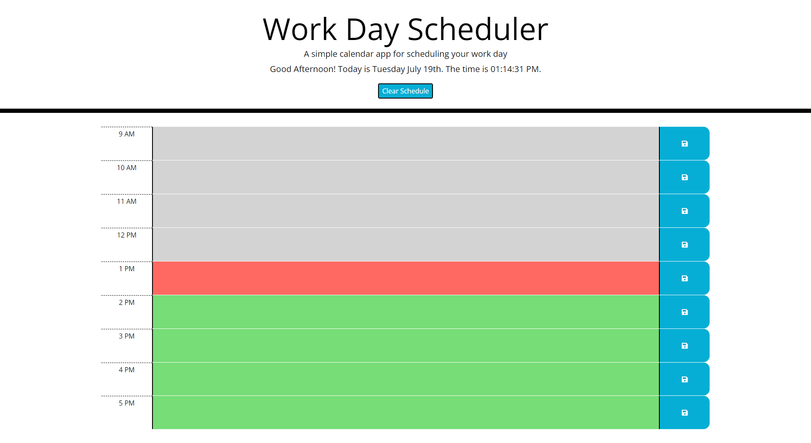
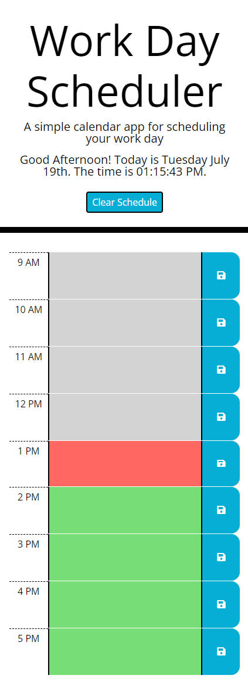
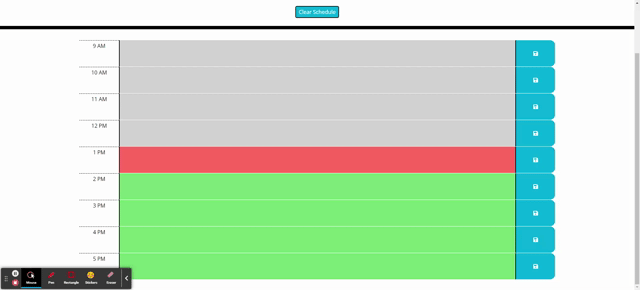

# My Work Day Scheduler

## Project Description

This project is a daily planner to schedule events that occur during standard business hours and to save those events for viewing at a later time.

## User Story

```
AS AN employee with a busy schedule
I WANT to add important events to a daily planner
SO THAT I can manage my time effectively
```
## Usage

Click any time block to select it and type the event you need to do at that given time denoted by the hour to the left of the time block.
Red is the present hour, green is the future, and gray is the past.
When ready click the save button to the right of the time block to save your plan, when refreshing or coming back to the page the event is still there.
To clear all time block events click the clear schedule button located below the current date/time.

## Images

### Desktop 



### Mobile 



### Scheduler Demo 



## GitHub Links

### [GitHub Repo](https://github.com/PierTwo/my-work-day)

### [Deployed GitHub Pages](https://piertwo.github.io/my-work-day/)

### Made with Bootstrap, Font Awesome, Google Fonts, JQuery, and Moment.js!